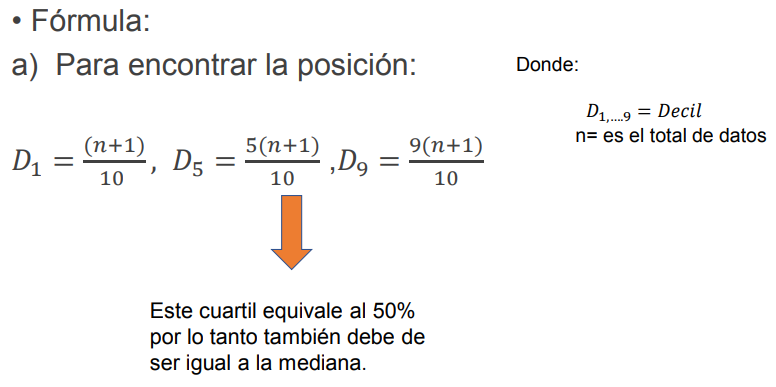
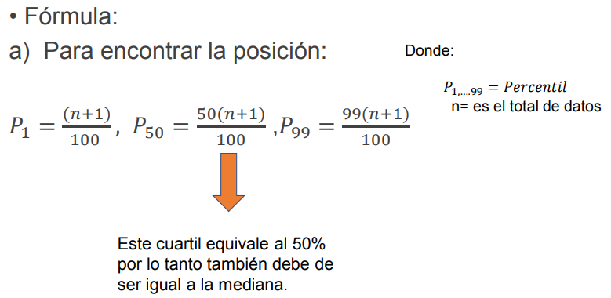
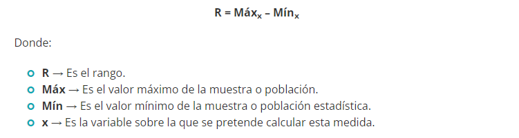
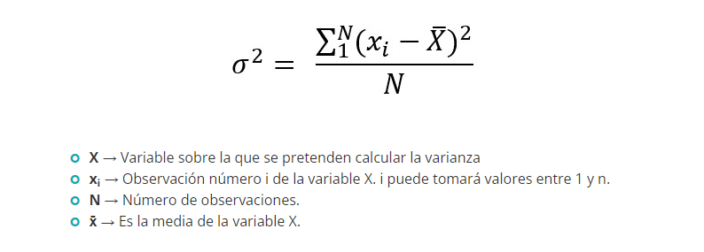
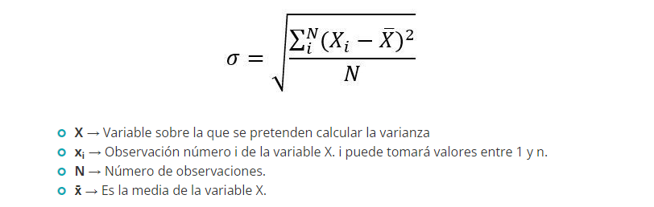

# Probabilidad y Estadística

<ol>

<li> 
    <h2>Concepto y utilidad de la estadística descriptiva</h2>
    <ul>
        <li>
            
Concepto

            
La estadística descriptiva es la técnica matemática que obtiene, organiza, presenta y describe un conjunto de datos con el propósito de facilitar el uso, generalmente con el apoyo de tablas, medidas numéricas o gráficas.

        </li>
        <li>
            
Utilidad

            
La estadística descriptiva es aplicable en casi todas las áreas donde se recopilan datos cuantitativos.

        </li>
    </ul>
</li>

 

<li> 
    <h2>Concepto y utilidad de la estadística inferencial</h2>
    <ul>
        <li>
            
Concepto

            
La estadística inferencial nos permite estimar parámetros poblacionales a partir de la muestra utilizada, así como realizar el contraste de hipótesis. Los test estadísticos aplicados dependerán de la naturaleza de nuestros datos y tipo de variables.

        </li>
        <li>
            
Utilidad

            
La estadística inferencial puede ser utilizada en una serie de ciencias por ejemplo en las ciencias naturales donde usa para describir modelos termodinámicos complejos, en el campo de la física cuántica, en la mecánica de fluidos y en la teoría cinética de los gases.

        </li>
    </ul>
</li>

 

<li>
    <h2>Definición de población, muestra y censo</h2>
    <ul>
        <li>
            
Población

            
En estadística, una población es un conjunto de elementos o eventos similares que son de interés para alguna pregunta o experimento.​ Una población estadística puede ser un grupo de objetos existentes o una hipotética y potencialmente infinita grupo de objetos concebidos como una generalización de la experiencia.

        </li>
        <li>
            
Muestra

            
En estadística, una muestra es un subconjunto de casos o individuos de una población. En diversas aplicaciones, interesa que una muestra sea representativa, y para ello debe escogerse una técnica de muestra adecuada que produzca una muestra aleatoria adecuada.

        </li>
        <li>
            
Censo

            
En estadística descriptiva, se denomina censo al recuento de individuos que conforman una población estadística, definida como un conjunto de elementos de referencia sobre el que se realizan las observaciones.

        </li>
    </ul>
</li>

 

<li>
    <h2>Variables y sus tipos</h2>
    
Una variable estadística es una característica de una muestra o población de datos que puede adoptar diferentes valores.

    
Aunque hay decenas de tipos de variables estadísticas, por norma general podemos encontrarnos dos tipos de variables:

    <ol>
        <li>
            <h3>Variables cuantitativas</h3>
            
Son variables que se expresan numéricamente.

            <ol>
                <li>
                    <h4>Variables continuas</h4>
                    
Toman un valor infinito de valores entre un intervalo de datos. EJ: El tiempo que tarda un corredor en completar los 100 metros lisos.

                </li>
                <li>
                    <h4>Variables discretas</h4>
                    
Toman un valor finito de valores entre un intervalo de datos.  EJ: Número de helados vendidos.

                </li>
            </ol>
        </li>
        <li>
            <h3>Variables cualitativas</h3>
            
Son variables que se expresan, por norma general, en palabras.

            <ol>
                <li>
                    <h4>Variables nominales</h4>
                    
Expresan un nombre claramente diferenciado. Por ejemplo el color de ojos puede ser azul, negro, castaño, verde, etc.

                </li>
                <li>
                    <h4>Variables ordinales</h4>
                    
Expresan diferentes niveles y orden.

                </li>
            </ol>
        </li>
    </ol>
</li>

 

<li>
    <h2>Distribución de frecuencias</h2>
    
Las tablas de distribución de frecuencias se utilizan cuando se recolectan datos, con ellas se pueden representar los datos de manera que es más fácil analizarlos.
    

    

    Se pueden elaborar tablas de distribución de frecuencias para datos no agrupados y para datos agrupados. Estas últimas se utiliza cuando se tienen muchos datos.
    

    

    Para elaborar tablas de distribuciones de frecuencia se debe tener en cuenta lo siguiente:
    

    

    Cuando hay muchos datos se agrupan en clases.
    Esto consiste en agrupar los datos en una distribución de frecuencias, que puede definirse como una ordenación o arreglo de datos en clases o categorías que muestran para cada una de ellas, el número de elementos que contiene, denominada frecuencia.
    

    <ul>
        <li>
            <h3>Clases</h3>
            
Es cada uno de los grupos en que se dividen los datos. Para determinar cuántas clases crear, se puede utilizar la siguiente fórmula (fórmula de Sturges)

            
( 𝑁ú𝑚𝑒𝑟𝑜 𝑑𝑒 𝑐𝑙𝑎𝑠𝑒𝑠 = 1 + 3,322 𝑙𝑜𝑔 𝑁 ) donde N es el número total de datos

        </li>
        <li>
            <h3>Intervalos</h3>
            
El intervalo de clase o el ancho de la clase (tamaño de la clase) es el espacio que hay entre el límite superior y el límite inferior de la clase, los cuales corresponden a los valores extremos de la clase. 

            
𝐴𝑛𝑐ℎ𝑜 𝑑𝑒 𝑐𝑙𝑎𝑠𝑒 = ( 𝑑𝑎𝑡𝑜 𝑠𝑢𝑝𝑒𝑟𝑖𝑜𝑟 - 𝑑𝑎𝑡𝑜 𝑖𝑛𝑓𝑒𝑟𝑖𝑜𝑟 ) / 𝑛ú𝑚𝑒𝑟𝑜 𝑑𝑒 𝑐𝑙𝑎𝑠𝑒𝑠 

        </li>
        <li>
            <h3>Límites</h3>
            
Los límites de clase son los valores que separan a una clase en particular de la anterior y de la siguiente.

        </li>
        <li>
            <h3>Límites reales o fronteras</h3>
            
Es el promedio del límite superior de la primer clase con el límite inferior de la segunda clase

            
( Ls primer clase + Li segunda clase ) / 2

        </li>
        <li>
            <h3>Marcas de clase</h3>
            
Es el punto medio de la clase. Se obtiene dividiendo entre dos la suma de los valores extremos de cada clase.

        </li>
        <li>
            <h3>Ejemplo de tabla de distribución de frecuencia</h3>
            <table>
                <tr>
                    <th>Clase</th>
                    <th>Intervalo</th>
                    <th>Li</th>
                    <th>Ls</th>
                    <th>Lr</th>
                    <th>Frec</th>
                    <th>Marca de clase</th>
                    <th>Frec Acum</th>
                </tr>
                <tr>
                    <td>1</td>
                    <td>10 - 20</td>
                    <td>10</td>
                    <td>20</td>
                    <td>20.5</td>
                    <td>11</td>
                    <td>15</td>
                    <td>11</td>                    
                </tr>
                <tr>
                    <td>2</td>
                    <td>21 - 31</td>
                    <td>21</td>
                    <td>31</td>
                    <td>31.5</td>
                    <td>10</td>
                    <td>26</td>
                    <td>21</td> 
                </tr>
                <tr>
                    <td>3</td>
                    <td>32 - 42</td>
                    <td>32</td>
                    <td>42</td>
                    <td>42.5</td>
                    <td>7</td>
                    <td>37</td>
                    <td>28</td> 
                </tr>
                <tr>
                    <td>4</td>
                    <td>43 - 53</td>
                    <td>43</td>
                    <td>53</td>
                    <td> - </td>
                    <td>6</td>
                    <td>48</td>
                    <td>34</td> 
                </tr>
            </table>
        </li>
    </ul>
</li>

 

<li>
    <h2>Medidas de tendencia central</h2>
    
Las medidas de tendencia central sirven para conocer en qué lugar se ubica el elemento promedio, o típico del grupo.

    <ul>
        <li>
            <h3>Media</h3>
            
La media es el valor promedio de un conjunto de datos numéricos, calculada como la suma del conjunto de valores dividida entre el número total de valores.

        </li>
        <li>
            <h3>Mediana</h3>
            
La mediana es un estadístico de posición central que parte la distribución en dos, es decir, deja la misma cantidad de valores a un lado que a otro.

        </li>
        <li>
            <h3>Moda</h3>
            
La moda es el valor que más se repite en una muestra estadística o población. No tiene fórmula en sí mismo. Lo que habría que realizar es la suma de las repeticiones de cada valor.

        </li>
    </ul>
</li>

 

<li>
    <h2>Medidas de posición en datos agrupados y datos no agrupados</h2>
    
Las medidas de posición son aquellas en donde puedes dividir los datos en dos partes iguales, llamada mediana, lo puedes dividir en cuatro partes iguales llamado cuartiles, en diez partes iguales llamados deciles y en percentiles dividir en 100 partes iguales.

    <ul>
        <li>
            <h3>Cuartiles</h3>
            
Se dividen los datos en cuatro partes iguales:

            
Q1 = 25%, Q2 = 50%, Q3 = 75% 

            </img>
        </li>
        <li>
            <h3>Deciles</h3>
            
Se dividen los datos en 10 partes iguales:

            
Se calcula desde el D1 hasta el D9

            </img>
        </li>
        <li>
            <h3>Percentiles</h3>
            
Se dividen los datos en 100 partes iguales

            
Se calculan del P1 al P99

            </img>
        </li>
    </ul>
</li>

 

<!-- 
<li>
    <h2></h2>
    <ul>
        <li>
            <h3></h3>
            

        </li>
        <li>
            <h3></h3>
            

        </li>
        <li>
            <h3></h3>
            

        </li>
    </ul>
</li>
-->
<li>
    <h2>Medidas de dispersión en datos agrupados y datos no agrupados</h2>
    
En otras palabras, las medidas de dispersión son números que indican si una variable se mueve mucho, poco, más o menos que otra. La razón de ser de este tipo de medidas es conocer de manera resumida una característica de la variable estudiada.

    <ul>
        <li>
            <h3>Rango / Amplitud</h3>
            
El rango es un valor numérico que indica la diferencia entre el valor máximo y el mínimo de una población o muestra estadística. Su fórmula es:

            </img>
        </li>
        <li>
            <h3>Varianza</h3>
            
La varianza es una medida de dispersión que representa la variabilidad de una serie de datos respecto a su media. Formalmente se calcula como la suma de los residuos al cuadrado divididos entre el total de observaciones. Su fórmula es:

            </img>
        </li>
        <li>
            <h3>Desviación típica o estándar</h3>
            
La desviación típica es otra medida que ofrece información de la dispersión respecto a la media. Su cálculo es exactamente el mismo que la varianza, pero realizando la raíz cuadrada de su resultado. Es decir, la desviación típica es la raíz cuadrada de la varianza.

            </img>
        </li>
    </ul>
</li>

 

## 9. Representaciones gráficas

### 9.1 Barras

### 9.2 Histograma

### 9.3 Polígono

### 9.4 Ojiva

### 9.5 Circular

 

## 10. Teoría de conjuntos

### 10.1 Operaciones de conjuntos

#### 10.1.1 Unión

#### 10.1.2 Intersección

#### 10.1.3 Diferencia

#### 10.1.4 Complemento

### 10.2 Diagrama de Venn

### 10.3 Diagrama de Euler

 

## 11. Espacio muestral

### 11.1 Diagrama de árbol

### 11.2 Combinaciones

### 11.3 Permutaciones

 

## 12. Probabilidad

### 12.1 Concepto y aplicación de probabilidad

### 12.2 Experimentos aleatorios y determinísticos

### 12.3 Distribuciones de probabilidad

#### 12.3.1 Binomial

#### 12.3.2 Normal

#### 12.3.3 Teorema de Bayes

</ol>
